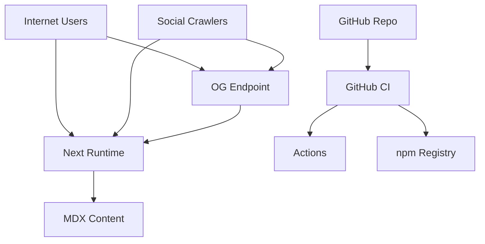

## Assumption Validation Check-In

- Production runtime in scope is the root Next.js app, not the archived Vite prototype (`README.md`, `repo.config.ts`).
- The site is internet-exposed and publicly accessible with no authenticated user area.
- Runtime data is primarily repository-backed MDX content and metadata; no database-backed user data flow is present.
- Public entry points are static/dynamic pages plus `GET /api/og`.
- CI/build boundary uses GitHub Actions + npm install/test/build pipeline.

Context questions:
1. Should `/api/og` remain public for arbitrary callers, or restricted to first-party callers only?
2. How many people can merge to `main` and edit `content/**/*.mdx`?
3. Should CI security gates be strictly blocking for PR merge?

## Executive summary

Top risk themes are: (1) public OG endpoint abuse and availability pressure, (2) content/MDX integrity risks from supply-chain or contributor compromise, and (3) CI/dependency supply-chain trust boundaries. Current controls improved baseline safety (input length checks, canonical host constraints, JSON-LD escaping), but additional hardening is required in headers, MDX sanitization policy, slug/path guards, and CI trust controls.

## Scope and assumptions

- In scope: `app/**`, `components/**`, `lib/**`, `content/**`, `.github/workflows/**`, `scripts/validate-content.mjs`.
- Out of scope: `docs/archive/prototypes/enhance-branding-implementation-plan-vite/**`.
- Assumption: No authn/authz runtime layer exists in current architecture.
- Assumption: Public site deployment on Vercel with HTTPS termination at edge.
- Assumption: MDX content is maintained by trusted contributors, but compromise scenarios remain in scope.

Open questions that materially affect risk ranking:
- Is WAF/rate-limiting configured for `/api/og` at platform edge?
- Are CODEOWNERS/branch protections enforced for `content/**` and workflow files?
- Are workflow/action provenance policies enforced at org level?

## System model
### Primary components

- Next.js App Router runtime serving pages and metadata routes.
- Edge OG image renderer (`app/api/og/route.tsx`).
- File-backed content subsystem (`lib/content.ts`) + MDX renderers in article routes.
- CI pipeline in GitHub Actions (`.github/workflows/ci.yml`).

### Data flows and trust boundaries

- Internet -> Next.js page routes
  - Data: URL path/headers
  - Channel: HTTPS
  - Security guarantees: TLS; no app auth layer
  - Validation: route-level slug resolution/notFound behavior
- Internet -> `/api/og`
  - Data: query params (`title`, `subtitle`, `kicker`)
  - Channel: HTTPS GET
  - Security guarantees: public unauthenticated access
  - Validation: param key/length/charset/entropy checks
- Repository MDX -> runtime renderer
  - Data: frontmatter + markdown
  - Channel: local filesystem reads
  - Security guarantees: trusted-repo assumption
  - Validation: frontmatter + body pattern checks via content validation script
- CI runner -> actions/dependencies
  - Data: workflow/action code and npm package artifacts
  - Channel: internet
  - Security guarantees: pinned actions + lockfile
  - Validation: dependency review + lint/typecheck/test/build + scheduled audit

#### Diagram

## Assets and security objectives

| Asset | Why it matters | Security objective (C/I/A) |
|---|---|---|
| Published content and brand trust | Core business value is policy/research credibility | I, A |
| Site and OG endpoint availability | Discoverability and social previews depend on uptime | A |
| Metadata correctness (canonical/OG URLs) | SEO and preview integrity | I |
| CI workflow integrity | Trust in deployed outputs and build process | I |
| Dependency chain integrity | Prevents malicious code in CI/runtime | I |

## Attacker model
### Capabilities

- Unauthenticated internet attacker can call all public routes repeatedly.
- Attacker can craft arbitrary OG query values within accepted constraints.
- Supply-chain attacker can target CI action/dependency resolution surfaces.

### Non-capabilities

- No direct runtime auth/session token theft vector in current app surface.
- No database query injection surface in current file-backed architecture.
- No exposed server-side shell execution endpoint from request input.

## Entry points and attack surfaces

| Surface | How reached | Trust boundary | Notes | Evidence (repo path / symbol) |
|---|---|---|---|---|
| Public pages | Browser/crawler HTTPS | Internet -> runtime | Mostly static content rendering | `app/page.tsx`, `app/about/page.tsx`, `app/contact/page.tsx` |
| Dynamic article routes | `GET /insights/[slug]`, `GET /research/[slug]` | Internet -> runtime; runtime -> content FS | Slug-driven content fetch and MDX render | `app/insights/[slug]/page.tsx`, `app/research/[slug]/page.tsx`, `lib/content.ts` |
| OG generator | `GET /api/og` | Internet -> edge route | Paramized image rendering hot path | `app/api/og/route.tsx` |
| Content validation pipeline | CI/local script execution | contributor -> CI -> runtime content | Frontmatter/body security checks | `scripts/validate-content.mjs` |
| CI workflow | PR/push/schedule | repo -> CI runner | Supply-chain and build-trust boundary | `.github/workflows/ci.yml` |

## Top abuse paths

1. OG availability abuse
   1. Attacker sends high-volume, high-cardinality `/api/og` requests.
   2. Cache miss pressure increases edge rendering work.
   3. Endpoint latency/cost rises and service quality degrades.
2. MDX integrity compromise
   1. Malicious or compromised contributor changes MDX content.
   2. Unsafe body patterns or links attempt to bypass rendering expectations.
   3. Brand integrity and user trust are impacted.
3. Slug/path probing
   1. Attacker sends traversal-like slug payloads.
   2. Filesystem resolution behavior is probed for bypasses.
   3. Potential unintended file access attempts or noisy probing occur.
4. CI action/dependency compromise
   1. Upstream action/dependency supply chain is compromised.
   2. Malicious code executes during CI.
   3. Build trust and repository integrity are threatened.
5. Metadata manipulation
   1. Malicious frontmatter attempts external canonical/OG host manipulation.
   2. SEO/social preview points off-site.
   3. Brand and crawler trust degrade.

## Threat model table

| Threat ID | Threat source | Prerequisites | Threat action | Impact | Impacted assets | Existing controls (evidence) | Gaps | Recommended mitigations | Detection ideas | Likelihood | Impact severity | Priority |
|---|---|---|---|---|---|---|---|---|---|---|---|---|
| TM-001 | Unauthenticated internet attacker | Public access to `/api/og` | Flood paramized OG renders to force expensive cache misses | Availability/cost degradation | OG endpoint availability | Param length/charset/entropy guards + response timing (`app/api/og/route.tsx`), identity-bound edge throttling (`proxy.ts`) | In-memory limiter is per-edge-instance (not globally centralized) | Move to platform/WAF-backed distributed rate limiting and keep route dashboards | Alert on request spikes, 429 rate, cache-miss ratio, route latency | Medium | Medium | medium |
| TM-002 | Malicious/compromised contributor | Merge rights to content/render code | Insert unsafe MDX/link payloads | Defacement/phishing/XSS-adjacent risk | Content integrity, brand trust | MDX sanitize plugin + URL protocol allowlist + validation scripts (`app/*/[slug]/page.tsx`, `components/mdx-components.tsx`, `scripts/validate-content.mjs`, `scripts/validate-codeowners.mjs`) + CODEOWNERS policy (`.github/CODEOWNERS`) | Required reviewer enforcement still depends on branch-protection settings | Enforce CODEOWNERS review + admin enforcement in repository branch protection | CI content lint failures + CODEOWNERS policy check + review audit trail | Medium | High | high |
| TM-003 | Internet attacker | Dynamic slug route reachability | Probe traversal-like slugs for file-read bypass | Potential disclosure/probing noise | Content filesystem boundary | Safe slug regex + path containment + `dynamicParams=false` (`lib/content.ts`, `app/*/[slug]/page.tsx`) + invalid-slug telemetry/short-circuit (`proxy.ts`) | Alert routing currently relies on log aggregation configuration | Add SIEM/alert thresholds on invalid slug burst events | Monitor invalid slug patterns and 404 anomaly bursts | Low | Medium | low |
| TM-004 | Browser abuse amplification | Victim page load + missing browser hardening | Exploit absent headers to increase blast radius of client-side issues | Clickjacking/exploit amplification | Visitor trust | Nonce-based CSP + security headers in edge proxy (`proxy.ts`) and nonce propagation to JSON-LD scripts (`app/layout.tsx`, `app/page.tsx`, `app/*/[slug]/page.tsx`) | `style-src` still permits `unsafe-inline` for framework compatibility | Incrementally migrate toward nonce/hash-based style policies | Keep header regression tests and scan responses for CSP drift | Low | Medium | low |
| TM-005 | CI supply-chain attacker | Compromised action tag or dependency | Execute malicious code on CI runner | Build/repo trust compromise | CI/workflow integrity | Pinned action SHAs, least-privilege permissions, dependency-review, scheduled audit, and PR high-risk change detection (`.github/workflows/ci.yml`) | Org-level branch protection and policy inheritance may still vary | Enforce org policy for SHA pinning and branch protections | Alert on workflow/lockfile-only changes and dependency-review failures | Medium | High | high |
| TM-006 | Metadata manipulator (content contributor) | Ability to edit frontmatter | Set off-policy canonical/OG URLs | SEO/brand manipulation | Metadata integrity | Canonical/OG host restrictions in runtime + validator (`lib/seo.ts`, `scripts/validate-content.mjs`) | Allowlist maintenance needed | Keep strict host allowlist and test coverage | CI fail on host policy violations | Low | Medium | low |

## Criticality calibration

- Critical: direct compromise of CI/runtime trust with persistent malicious code execution or broad integrity loss.
  - Examples: CI runner compromise via unpinned actions; dependency-chain compromise with persistent malicious artifact influence.
- High: realistic abuse with significant impact but narrower prerequisites.
  - Examples: sustained OG endpoint abuse; malicious merged content affecting public trust.
- Medium: plausible exploitation that depends on additional conditions or has constrained impact.
  - Examples: slug probing, browser-hardening gaps.
- Low: hygiene/integrity edge cases with lower blast radius.
  - Examples: off-policy metadata hosts caught by validation controls.

## Focus paths for security review

| Path | Why it matters | Related Threat IDs |
|---|---|---|
| `app/api/og/route.tsx` | Public computational endpoint and anti-abuse controls | TM-001 |
| `lib/content.ts` | Slug and filesystem boundary enforcement | TM-002, TM-003 |
| `app/insights/[slug]/page.tsx` | Dynamic render path + sanitize policy | TM-002, TM-003 |
| `app/research/[slug]/page.tsx` | Dynamic render path + sanitize policy | TM-002, TM-003 |
| `components/mdx-components.tsx` | External link protocol safety | TM-002 |
| `scripts/validate-content.mjs` | Content guardrails and policy enforcement | TM-002, TM-006 |
| `lib/seo.ts` | Canonical/OG host control plane | TM-006 |
| `proxy.ts` | Edge security controls for CSP, OG rate limiting, and slug probe telemetry | TM-001, TM-003, TM-004 |
| `next.config.ts` | Static baseline security headers (non-CSP) | TM-004 |
| `.github/workflows/ci.yml` | CI trust boundary and supply-chain controls | TM-005 |
| `scripts/validate-codeowners.mjs` | Enforced CODEOWNERS rule coverage in CI | TM-002 |

## Quality check

- All discovered entry points covered: yes.
- Each trust boundary represented in threats: yes.
- Runtime vs CI/dev separated: yes.
- Assumptions and open questions explicit: yes.
- Remediation mapped to concrete code locations: yes.
